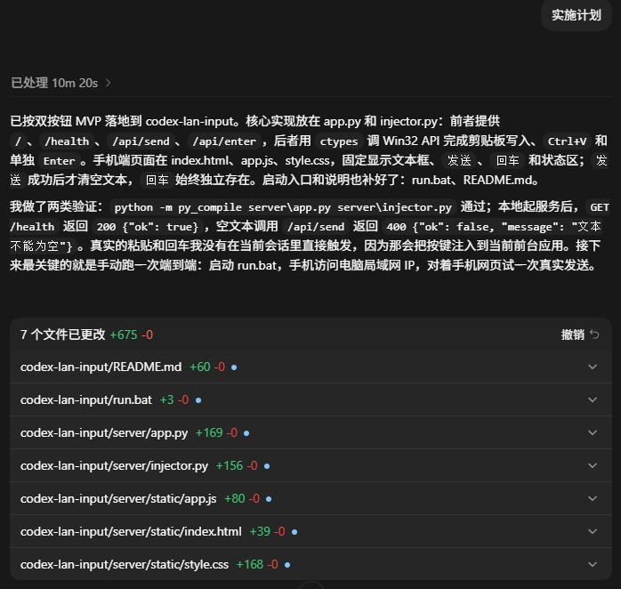

# Codex LAN 输入

用手机语音输入文本，把文本发送到 Windows 上当前聚焦的 Codex 输入框，也可以单独远程按一次回车。

## 功能

- 手机网页输入文本后点击`发送`，电脑端把文本写入剪贴板并发送`Ctrl+V`
- 手机网页点击`回车`，电脑端单独发送一次`Enter`
- `发送`成功后才清空文本框，失败时保留原文本
- 注入动作互斥执行，避免快速重复点击造成按键交错

## 运行要求

- Windows
- Python 3.14 或兼容版本
- 手机和电脑在同一局域网

## 启动方式

在项目根目录运行：

```bat
run.bat
```

或者直接运行：

```bat
python server\app.py
```

服务默认监听：

```text
http://0.0.0.0:8765
```

## 手机端使用

1. 先把 Codex App 放到前台，并确认输入框保持选中。
2. 在电脑上启动服务。
3. 在电脑上查看局域网 IP，例如运行 `ipconfig` 后找到当前网络的 IPv4 地址。
4. 手机浏览器打开 `http://<电脑局域网IP>:8765/`。
5. 在手机网页里用系统自带语音输入法输入文本。
6. 点击`发送`把文本粘贴到 Codex。
7. 需要单独确认或提交时，点击`回车`发送一次 `Enter`。



*本项目使用 Codex 完成*

## 接口

- `GET /`：手机网页
- `GET /health`：健康检查
- `POST /api/send`：发送文本，JSON 请求体为 `{"text": "..."}`
- `POST /api/enter`：发送一次回车

## 重要说明

- 这一版不包含鉴权，局域网内任何能访问这个地址的设备都能触发粘贴或回车。
- 这一版不包含窗口识别、前台检查和自动聚焦。
- 如果发送期间切换到了别的窗口，文本可能会被粘贴到错误的位置。
- 这一版不包含原系统剪贴板内容恢复。
